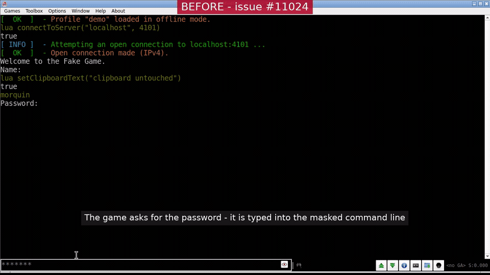

# The hidden-input box

When a game asks for hidden input (`IAC WILL ECHO`, RFC 857), Mudlet answers with a
dedicated box over the main command line instead of masking the command line's own
text. This records the design so that its rules are not rediscovered one bug report at
a time; issue #11024 lists what the earlier approach cost.

## The one idea

**The password never enters `TCommandLine`.** While the game holds ECHO, a separate
`QLineEdit` in password echo mode (`TPasswordEntry`) sits over the command line and takes
its keyboard through a focus proxy. Enter hands its text to `Host::sendPasswordEntry()`,
which goes straight to `cTelnet::sendData()` with the `sysDataSendRequest` event withheld:
no alias pass, no command-separator split, no local echo, no history. Nothing attached
to the command line can see the password because it was never there.

**Protection is removed only by the game or by the player.** The box closes when the
game releases ECHO (WONT, disconnect, or the existing 60 s login-phase safety timeout
that stands in for a WONT the game forgot), when the player steps past it with Esc, or
when the profile's preference says never to open one. Nothing Mudlet infers about the
game - character-at-a-time recognition in particular - closes it, so a retry after a
rejected password is never typed in the clear. The only other exceptions belong to the
auto-login (below).

## Where the pieces live

| Piece | Where |
| --- | --- |
| Policy: `passwordEntryWanted()`, its inputs and mutators, `sendPasswordEntry()`, the one signal | `Host` (core side of the core/front-end split, #9011; answers with no view) |
| The auto-login-pending input and the encoding warning that never quotes hidden input | `cTelnet` |
| The box itself: key surface, placeholder wording, reveal toggle, Paste-only menu | `TPasswordEntry` (front-end) |
| Open, close, focus, geometry, Lua writes to "main" | `TMainConsole` |
| Redirect of synthetic keys to the proxy; the `playerTypedLine()` fact; reporting the player's line | `TCommandLine` |
| Policy tests | `test/functional_tests/PasswordEntryPolicyTest.cpp` (telnet group) |
| Box tests | `test/functional_tests/PasswordEntryTest.cpp` (window group) |
| Lua-visible behaviour | `src/mudlet-lua/tests/CommandLine_spec.lua` |

`Host::passwordEntryWanted()` is
`echo && !preference && !suppressed && !dismissed && !autoLoginPending`, computed in
`recomputePasswordEntryWanted()` and nowhere else. `suppressed`, `dismissed` and the Esc
count are per ECHO hold and cleared by every `setRemoteEchoingActive(false)`, whether or
not the value changes, so nothing outlives a hold or a connection. A transition that
changes two inputs goes through one Host method that recomputes once, because a Lua spec
must see the result the moment `feedTelnet` returns; nothing is deferred.

## Rules the code keeps

1. No code path writes text out of the box into the command line, its history, its
   document or its selection. Text may move *into* the box from the command line when it
   opens (below).
2. The box's text is sent from exactly one place, `TPasswordEntry::submit()`, and nothing
   else in Mudlet reads it beyond asking whether it is empty; no close path reads it. That
   is a convention `QLineEdit`'s public `text()` cannot enforce, so `TMainConsole` hands the
   widget to nothing but its tests.
3. Everything that means "focus the main command line" lands on the box while it is up:
   `mpCommandLine->setFocusProxy(box)` plus one redirect for synthetic key presses in
   `TCommandLine::event()`.
4. A fresh widget per prompt: created on open, deleted on close, in password echo mode so
   Qt zero-fills what it still holds.
5. Everything else about the command line behaves exactly as with no prompt open, with one
   exception: while the game hides input and the preference is off, a line typed into the
   command line - past the box, after an Esc or while the auto-login holds it back - stays
   out of the history, which is written to disk.

## What the player sees

| Situation | What happens |
| --- | --- |
| WILL ECHO with a command left in the command line (selected, recalled with Up, or written by a script) | the box opens over it and takes focus; the command line is untouched behind it |
| WILL ECHO while the player is typing (`hunt` of `hunter2`) | that text moves into the box, masked; typing `er2` and Enter sends `hunter2` whole. The rule is a fact about how the text got there (`TCommandLine::playerTypedLine()`: every character came from a key or a paste starting from an empty or wholly selected line), not a guess about history |
| Enter | sent by the one path; the box empties, says "Sent - waiting for the game" and stays up until the game releases ECHO, so a rejected password is retried inside it |
| WONT ECHO | the box closes, text in it discarded, focus back on the command line if the box had it |
| Esc with text | the box empties (start over) |
| Esc on an empty box, first time in the hold | the box closes; after the player's next Enter on a command line (a trigger's, timer's or key binding's send does not count) the game's next text ends the dismissal (its negotiation or an out-of-band message alone answers nothing): a WONT ends the hold, text under the held ECHO means the game has answered and still hides input, so the box comes back saying "Still hidden - Esc again...". Only the box the prompt itself opens takes text being typed in the command line; one that comes back later in the hold leaves it where it is |
| Esc on an empty box, second time in the hold | no box until the game releases ECHO |
| A game that hides everything | two Escs per hold, or the profile preference "Do not open a hidden-input box when the game asks for hidden input" |
| GoMud (its #633 and later) | a box per password step, closed by its WONT; a rejected password re-prompts under the held ECHO and is retried inside the box |
| Auto-login with stored credentials | no box while the auto-login still intends to send the password (a command typed ahead stays in the command line); once it has sent under the game's mask, no box until the game answers: a WONT ends the hold, text under the held ECHO (a rejected password's re-prompt, or a forgotten WONT) opens a box for the retry with the typed-ahead command left in the command line; a late keychain password sent under ECHO waits the same way. Cost: on a link slow enough that the password goes out before the game's WILL ECHO arrives, that late WILL opens a box, text typed ahead moves into it and the WONT that follows drops it (raise the auto-login password delay for such a game) |
| Keychain prompt unanswered or refused | a box opens; its first edit cancels the auto-login |
| A script, trigger or key binding sends the password | goes through `Host::send()` as before, aliases and all |
| Enter in the box while not connected (or during a replay) | the text is dropped, the box says "Not sent" and a warning line says why |
| The preference turned on while a box is up | the box closes and drops its text; typed input goes through the command line from then on, history included |
| A label's `prompt:` link clicked while a box is up | the text lands in the box for Enter to send; a script's write, so it does not count as the player's first edit and cancels no auto-login |
| The ECHO anomaly latch (five WILL/WONT toggles inside five seconds) | cTelnet refuses ECHO for the rest of the connection, as before: no box, input in the clear |
| The login-phase timeout fires (a game that forgot its WONT) | the box closes and drops its text, and a warning line says so |
| F-key, Ctrl+letter or Alt+arrow binding pressed in the box | offered to the key bindings; a plain printable key is typed, never offered; Tab, Shift+Tab, Up and Down with no other modifier stay in the box, as in the command line |
| `printCmdLine("main", ...)`, `sendCmdLine()`, an MXP `prompt:` link during a prompt | the text goes into the box; `getCmdLine("main")` still reads the command line |
| Sub command line during a prompt | untouched, and its Lua action runs |
| Caret mode's shortcut | leaves for the output pane; a printable key typed there comes back to the box |
| A password typed and submitted before WILL ECHO arrives | goes through `Host::send()` in the clear, as before; nothing without a heuristic can help |

## What it does not do

- Memory hygiene beyond Qt's zero-fill and the send path zeroing its own local: copies
  exist in the encoder's byte array, the socket buffers and TLS.
- Styling: `setCmdLineStyleSheet("main", ...)` styles a `QPlainTextEdit`; the box uses the
  command line's font and palette.
- Change how Mudlet decides a prompt is a password prompt. That stays in `cTelnet`.
